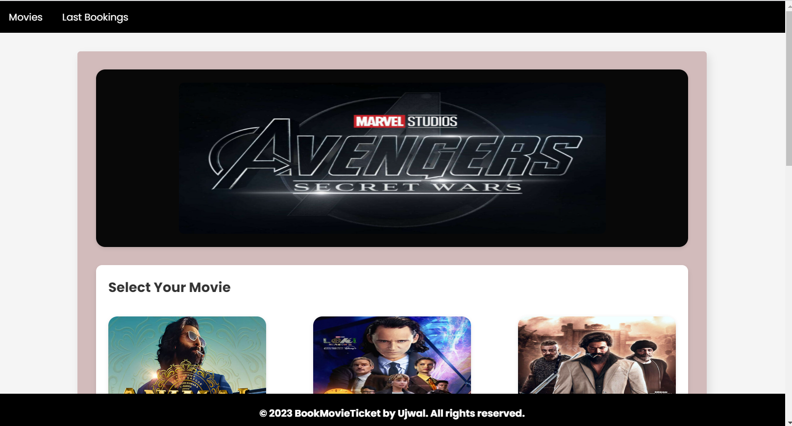
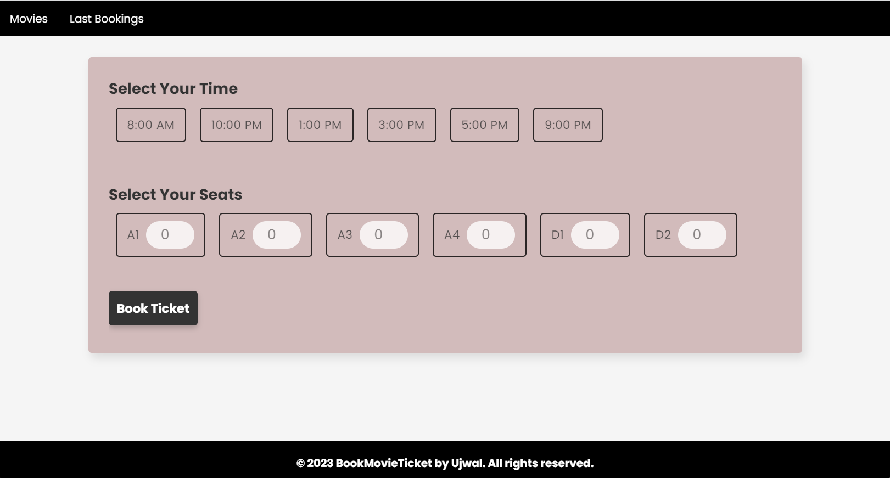

# Book Movie Ticket

## Overview

Book Movie Ticket is a web application that allows users to browse and book movie tickets for their favorite films. The application provides a user-friendly interface to select movies, choose show timings, and pick seats for an enjoyable cinema experience.

## Features

- **Movie Selection:** Browse through a diverse collection of movies with detailed information.
- **Show Timings:** Choose from a variety of show timings for your selected movie.
- **Seat Selection:** Easily select your preferred seats in the cinema hall.
- **Booking Confirmation:** Confirm your booking and receive a ticket with all the necessary details.

## Technologies Used

- React: Front-end JavaScript library for building user interfaces.
- React Router: Library for handling navigation and routing in React applications.
- Bootstrap: CSS framework for responsive and visually appealing designs.
- Express.js: Web application framework for building the backend server.
- Node.js: JavaScript runtime for server-side development.
- MongoDB: NoSQL database for storing movie bookings.
- Mongoose: ODM (Object Data Modeling) library for MongoDB and Node.js.
- Fetch API or Axios: For making HTTP requests from the frontend to the Express backend.
- localStorage: For storing temporary user selections on the client-side.


## Getting Started

Follow these instructions to get a copy of the project up and running on your local machine for development and testing purposes.

1. Clone the repository:

   ```bash
   git clone https://github.com/Ujwaldevgade/BookMovieTicket.git
   
   npm install
   npm start

## Link to website -> [BookMyShow](https://bookmy-show.netlify.app/)


## Screenshots

### Home Page

### Booking Section


### Additional Feature


